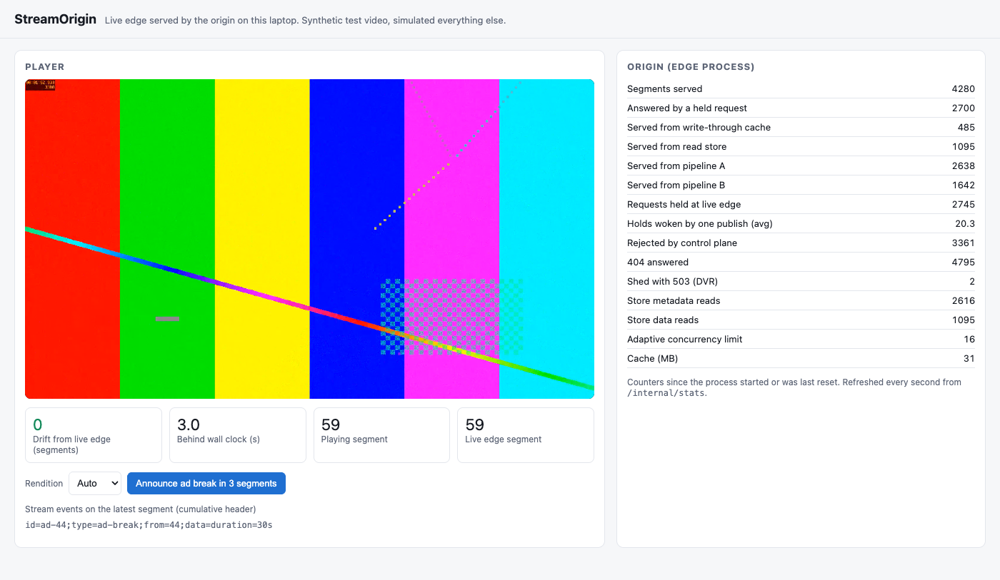

# StreamOrigin

StreamOrigin is a live video origin server in Java 21 and Spring WebFlux. It takes two-second
CMAF segments from two independent encoding pipelines over HTTP PUT and serves them to a fleet of
edge caches over HTTP GET. It picks the first valid copy across pipelines, holds a live-edge
request open until the segment lands instead of answering 404, caches misses until the segment
is due, rejects impossible requests before touching storage, keeps the publish path isolated from
read storms, and sheds replay traffic before live traffic under overload. **What it does not
claim:** everything runs on one laptop. The edge caches are simulated by a load generator in this
repo, the video is ffmpeg's synthetic test pattern, the "replicated" store is two Redis
instances, and there are no real viewers or CDN. The design follows a published description of a
production live origin, credited in [`DESIGN.md`](DESIGN.md); the point was to build it and
measure the trade-offs, not to reproduce anyone's scale.

## What was measured

Every figure is the median of three runs on one laptop (Apple M3 Pro, 18 GB), with the range and
the raw rows in [`NUMBERS.md`](NUMBERS.md) and `results/*.jsonl`. The baseline is the naive origin
(the same code with every serve-path feature off, both paths on one process and one store
connection) unless the row names a narrower one.

| Question | Baseline | StreamOrigin |
|---|---|---|
| Live-edge 404s per minute, 50 caches asking before the segment exists (exp2) | 13,496 | **0**: every request held and answered by the publish, 50 per publish |
| Publish to first byte at the caches, p50 (exp2) | 463 ms | **51 ms** |
| Segment write p99 while 100 caches storm the newest segment (exp1) | 779 ms, over the 500 ms budget | **45 ms** (92 ms if publish and serve share one process) |
| Store reads per published segment in that storm (exp1) | 238 | **0.5** |
| Pipeline A drops 30% of segments: segments missing at the caches (exp3) | 750 with one pipeline | **0**, served from pipeline B |
| Pipeline A sends 10% garbage with no defect flag: corrupt segments delivered (exp3) | 150 | **0** |
| 3,000 requests/s for segments that cannot exist: reads reaching the store (exp4) | 1 per request | **0**: all rejected from memory |
| Read store made 200 ms slower: write p99 (exp6) | 466 ms (shared store) | **50 ms** (isolated) |
| Replay traffic at 2x capacity: live segments missed of 2,250 (exp5) | 1,523 with priority off | **0**: replay held to capacity, half refused with 503 |
| Edge-server killed mid-stream: live segments missed of 4,500 (exp7) | | **0**, healthy again in 2.2 s |
| Five minutes of seeded random faults, three runs: segments missed or corrupt (exp8) | | **0 of 67,500** |

A browser plays the live edge through the origin with **0 segments of drift**, about 3 s behind
the wall clock (headless Chrome and hls.js, `results/m5_player.jsonl`):



The bugs found on the way, including the ones that invalidated early numbers, are in
[`BUG_LOG.md`](BUG_LOG.md).

## Run it

Needs JDK 21, Docker, ffmpeg and Python 3.

```bash
./gradlew build                      # unit, property and Testcontainers tests
scripts/e2e.sh                       # 30 s end to end: two pipelines, A drops 20%, no gaps allowed
scripts/demo.sh                      # live ffmpeg pipelines; open http://localhost:27081/demo/index.html
python3 bench/experiments.py exp2    # one experiment, 3 repeats, rows appended to results/exp2.jsonl
python3 bench/ledger.py              # regenerate NUMBERS.md from results/*.jsonl
docker compose --profile obs up -d   # Prometheus on :27090, Grafana dashboard on :27030
```

## What is where

| Path | What |
|---|---|
| `core/` | Everything both processes share: the event template and schedule (`schedule/`), control plane (`control/`), the chunked key-value store with Redis, RocksDB and in-memory backends (`store/`), the serve path: first-valid resolution, write-through cache, coalescing, live-edge holds, admission (`serve/`), the publish path (`publish/`), DASH and HLS manifests (`manifest/`) |
| `publish-server/` | Spring Boot app: packagers PUT here (port 27080) |
| `edge-server/` | Spring Boot app: edge caches GET here (port 27081); also runs the naive single-process origin; serves the demo page |
| `packager/` | Renders the test stream with ffmpeg and publishes it on schedule for one pipeline, with drop, corrupt, lag and fail injection; `live` mode runs ffmpeg in real time |
| `edge-sim/` | The simulated edge fleet: live caches that follow the template, DVR readers, and a junk-request generator |
| `bench/` | Experiment harness (`experiments.py`), ledger generator (`ledger.py`) |
| `results/` | Every measured run, one JSON row each, with machine and load |
| `DESIGN.md`, `NUMBERS.md`, `BUG_LOG.md` | Why it is built this way, every figure with its source, every bug with what found it |
